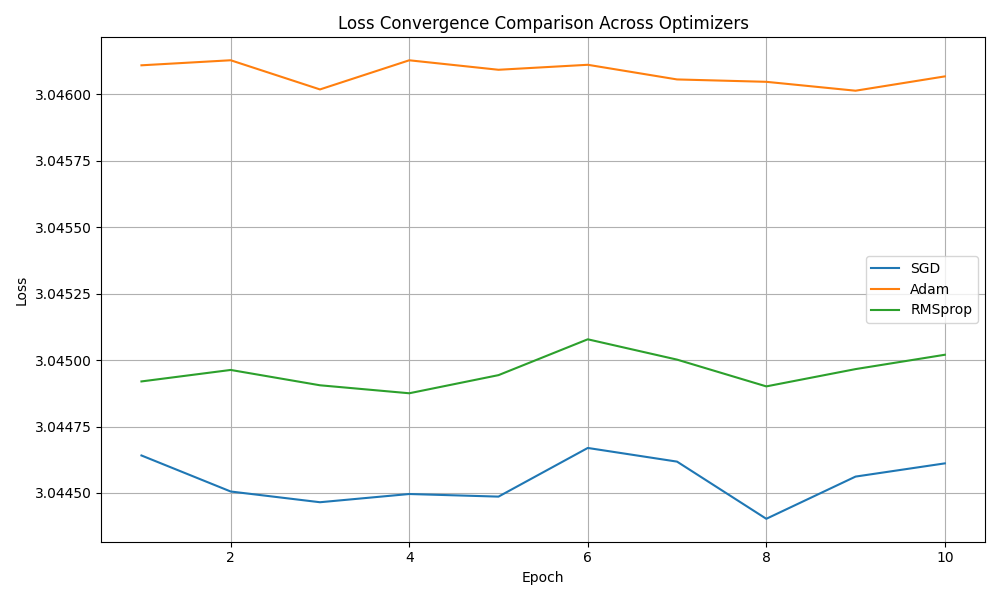

# GNR-638 Assignment 4  
Submitted by: Siddhant Chourasia and Prankul Yadav  

---

This project extends the land use classification task from Assignment 3 by experimenting with different optimizers to study their impact on model convergence. The goal is to compare the performance of **SGD**, **Adam**, and **RMSprop** optimizers when training a convolutional neural network (CNN) on the **UC Merced Land Use dataset**.

The UC Merced Land Use dataset consists of **21 land use classes**, with **100 images per class**. The dataset is split into:
- **70% training set**  
- **10% validation set**  
- **20% test set**  

The images are resized to **224x224 pixels** to match the CNN input size. The model is evaluated based on how quickly or slowly it converges with different optimizers.

---

## Objectives
- To explore how different optimizers affect the convergence rate of a CNN model.
- To implement and train a CNN using **SGD**, **Adam**, and **RMSprop**.
- To visualize the loss curves for each optimizer and analyze their performance.

---

## Results

### **Loss Convergence Across Optimizers**
The following plot shows the loss curves for different optimizers over the training epochs. The goal is to evaluate how quickly each optimizer converges and which one results in the lowest final loss.

  

---

## **Detailed Description of the Code**  

### **Data Preprocessing:**
- The dataset is loaded using `torchvision.datasets.ImageFolder`.
- Preprocessing steps:
  - Resize images to **224x224**.
  - Convert images to tensors.
  - Normalize using ImageNet mean and standard deviation values.

### **Model Architecture:**
- The `SmallCNN` class defines a CNN with:
  - **3 convolutional layers** (with ReLU activations and max pooling).  
  - **2 fully connected layers** (512 hidden units).  
  - Final classification layer for 21 classes.  

### **Training with Different Optimizers:**
- Three optimizers are tested:
  - **SGD** – Learning rate = 0.01, momentum = 0.9  
  - **Adam** – Learning rate = 0.001  
  - **RMSprop** – Learning rate = 0.001  

- The model is trained for **10 epochs** using CrossEntropyLoss.  
- For each optimizer:
  - The model is re-initialized to ensure fair comparison.
  - The average training loss per epoch is recorded and plotted.  

### **Plotting Loss Curves:**
- The loss curves are plotted using `matplotlib`.
- The figure shows the rate of convergence and the final loss for each optimizer.

---
